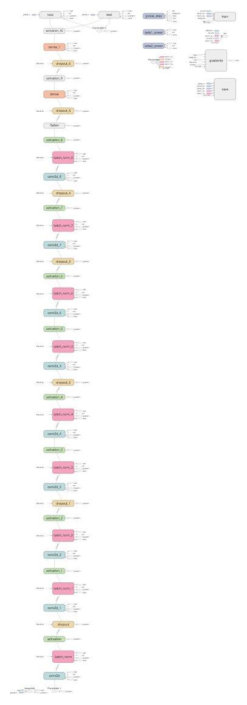

# Kaggle/State Farm Image Recognition Challenge

Given a dataset of 2D dashboard camera images, State Farm is challenging Kagglers to classify each driver's behavior. Are they driving attentively, wearing their seatbelt, or taking a selfie with their friends in the backseat?

## Jupyter Notebook

[Check Notebook for an overview of the implementation](http://nbviewer.jupyter.org/github/MarvinBertin/Kaggle_State_Farm/blob/master/6005-Final-Project-Marvin-MikeU.ipynb)

## Model Architectures

### VGG Neural Network
* Developed by the [Visual Geometry Group](http://www.robots.ox.ac.uk/~vgg/research/very_deep/) at the University of Oxford.  
* It is class of very deep Convolutional Networks for large-scale Visual Recognition tasks.  
* **Won** the **first and the second places** in the localisation and classification tasks respectively at the **ImageNet ILSVRC-2014 contest**.

### Deep Residual Neural Network (Resnet)
* Developed by Microsoft Research.  
* **Won 1sth place** in classification tasks at the **ImageNet ILSVRC-2015 contest**.  
* The residual learning framework makes is easier to optimize much deeper networks, while maintaining a relativaly low complexity.
* Regular neural networks tend to **decrease in accuracy** at large depths, due to **information degradation**.
* Residual learning introduce **skip connections**, which allow information flow into the deeper layers and enable us to have **deeper networks** with **better accuracy**.

